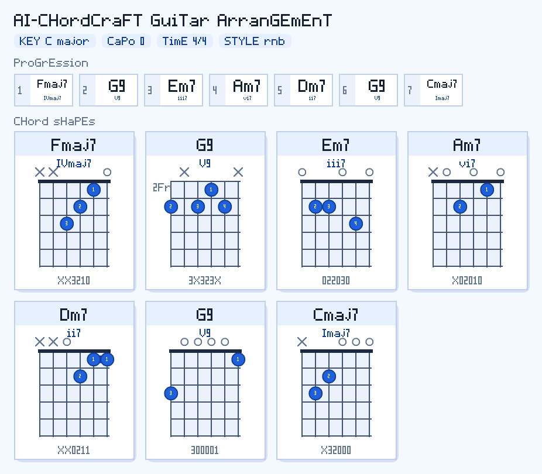
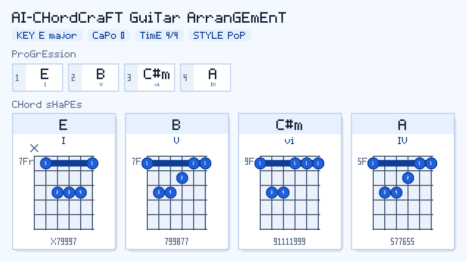
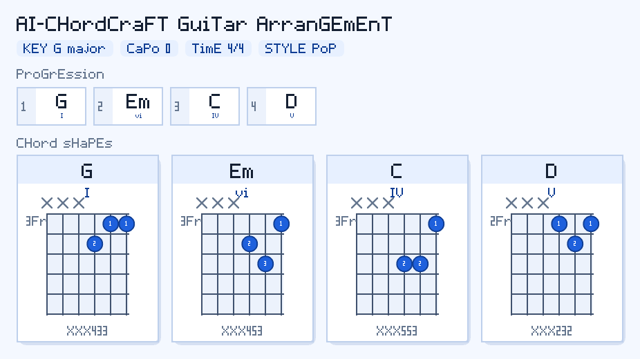

# AI Musician Skills

> 帮助音乐人把创作灵感变成各乐器真正能上手的编配版本。

AI Musician Skills 是一套 Agent 编曲辅助技能集，借助 Agent 的理解和规划能力，把复杂的编曲判断拆成清晰、可执行的建议——让新手快速跨过"看得懂但弹不出来"的阶段，也让有经验的编曲人更快完成从想法到谱面的转化。

---

## 📢 News

**2026-06** — 开源第一个技能：[**`guitar-arrange-skill`**](#guitar-arrange-skill) 🎸

面向吉他手的智能指法安排技能，支持数字级数输入、风格化编配、中高把位、小型三和弦、R&B 色彩和弦等场景。

---

## guitar-arrange-skill

把一段和弦进行（或自然语言描述）变成一份**真正可弹奏**的吉他编配，包含指法选择、把位安排和和弦图输出。

### 能处理什么

- **数字级数 → 指法**：`E 大调 1-5-6-3-4-1-2-5` 直接转成具体和弦 + 常用指型
- **风格化编配**：R&B 进阶指法、Blues 12小节展开、流行三和弦等
- **把位限定**：指定不同把位时安排合适的吉他指法
- **小型三和弦**：乐队伴奏场景，生成高音1–3弦上的三和弦压缩指型


### 示例输出

**C 大调 R&B 进阶 `4-5-3-6-2-5-1`**（Fmaj7 G9 Em7 Am7 Dm7 G9 Cmaj7）



**E 大调 `1-5-6-4` 中间把位**（E B C#m A，5–9 品区间）



**G 大调 `1-6-4-5` 小型三和弦**（G Em C D，高音1–3弦乐队伴奏指型）



### 安装

```bash
git clone https://github.com/jassary08/AI-Musician-Skills.git
cd AI-Musician-Skills
./install.sh          # 同时安装到 Claude Code 和 Codex CLI（软链接）
```

```bash
./install.sh --target claude   # 只装 Claude Code
./install.sh --target codex    # 只装 Codex CLI
./install.sh --uninstall       # 卸载
```

装完后重启 Agent 会话，技能即生效。也可以手动软链接：

```bash
mkdir -p ~/.claude/skills
ln -s "$PWD/guitar-arrange-skill" ~/.claude/skills/guitar-arrange-skill
```

### 使用方式

Agent 会根据 `SKILL.md` 自动识别并调用（触发词如"帮我安排吉他指法"、"编配成吉他版"、"推荐变调夹"、"给我中间把位"、"小型三和弦"）。也可以直接跑脚本：

```bash
# Agent 传入具体和弦（推荐方式）
python guitar-arrange-skill/scripts/compose_guitar.py \
  --chords "E B C#m G#m A E F#m B" \
  --key "E major" --style pop --user-level intermediate --pretty

# 中间把位
python guitar-arrange-skill/scripts/compose_guitar.py \
  --chords "E B C#m A" --key "E major" --position-range "5-9" --pretty

# 小型三和弦（高音三根弦）
python guitar-arrange-skill/scripts/compose_guitar.py \
  --chords "G Em C D" --key "G major" --small-triad-strings "3,4,5" --pretty

# 导出和弦图 PNG
python guitar-arrange-skill/scripts/compose_guitar.py \
  --chords "Fmaj7 G9 Em7 Am7 Dm7 G9 Cmaj7" --key "C major" --style rnb \
  --diagram-png-output /tmp/chords.png --pretty
```

支持风格：`pop` `rock` `rnb` `blues` `funk`

---

## 路线图

| # | 技能 | 状态 |
|---|---|---|
| 1 | `guitar-arrange-skill` — 变调夹、把位、指法、和弦图 | ✅ 已发布 |
| 2 | 和声分析 — 罗马数字级数、和声功能、终止式 | 🔜 计划中 |
| 3 | 钢琴把位 — shell voicing、开放排列、重配和声 | 🔜 计划中 |
| 4 | 贝斯线 — 根据和弦谱生成 walking bass、律动型 | 🔜 计划中 |
| 5 | 鼓组律动 — 根据段落风格给出律动建议 | 🔜 计划中 |

---

## 目录结构

```
AI-Musician-Skills/
  README.md
  install.sh                     ← 安装脚本
  assets/                       ← 示例输出图
  guitar-arrange-skill/
    SKILL.md                     ← Agent 指令文档
    agents/openai.yaml           ← Agent 注册元数据
    resources/                   ← 风格卡、规则文件、和弦数据库
    scripts/                     ← Python 入口脚本
```

## 相关项目

- **AI-ChordCraft** — <https://github.com/jassary08/AI-ChordCraft>
